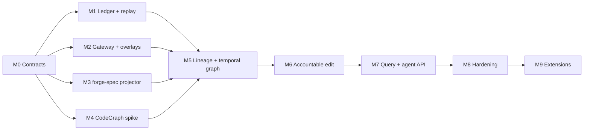
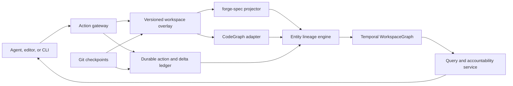

# Temporal Workspace Graph - Detailed Implementation Plan

Status: proposed

Purpose: define the implementation sequence for a separate project that records software-development actions and intermediate edits, projects each workspace state into spec and code graphs, and provides historical accountability between Git commits.

Companion visual brief: [Temporal Workspace Graph architecture brief](../output/pdf/temporal-workspace-graph-brief.pdf)

This document is planning material. It does not describe capabilities currently implemented by forge-spec.

## 1. Decisions already made

1. The system will be a separate project built above forge-spec, Git, and a code-intelligence provider.
2. forge-spec remains the authoritative engine for specifications, requirements, invariants, decisions, tasks, and explicit source references.
3. CodeGraph will be reused behind a replaceable adapter for code extraction, resolution, framework relationships, and current-state queries.
4. CodeGraph's database, node IDs, watcher, installer, telemetry, and history model will not be authoritative contracts.
5. Stable entity identity, action recording, byte deltas, temporal graph storage, replay, policy evidence, and accountability queries will be implemented in-house.
6. Git remains the publication, branching, collaboration, and interoperability layer. Commits anchor ranges of intermediate deltas.
7. The system will distinguish three truth classes:
   - authoritative intent and committed bytes;
   - a durable action and delta ledger;
   - rebuildable semantic projections.
8. A coherent intermediate state may be valid, degraded, invalid, or stale. The system must represent that status explicitly rather than hide incomplete projection work.

### 1.1 Delivery sequence at a glance



M1 through M4 can proceed in parallel after M0 freezes the shared identifiers, record schemas, provenance model, and projector contract. M5 is the integration point; it should not begin by inventing alternative contracts locally.

## 2. Objectives

The first production-capable version must be able to:

- record every mediated agent action, including reads, queries, approvals, failures, retries, and writes;
- detect and import external file changes that bypass the action gateway;
- assign stable identities to actions, deltas, artifacts, entities, projections, graph views, and Git checkpoints;
- reconstruct exact workspace bytes from a Git checkpoint plus an ordered delta prefix;
- project `.specs/` changes through forge-spec without requiring a commit;
- project source changes through CodeGraph without adopting CodeGraph's storage or identity model;
- retain entity lineage across line changes, symbol renames, and file moves where the evidence is sufficient;
- publish a coherent temporal graph for any retained delta;
- connect request, approval, action, byte change, semantic impact, verification, and commit;
- answer historical queries without changing the worktree;
- delete and rebuild all derived projections from the durable inputs;
- report provenance, confidence, completeness, and projector version with every inferred result.

## 3. Explicit non-goals for the first release

The first release will not attempt to provide:

- a replacement for Git branches, merges, remotes, or commits;
- a blockchain or distributed consensus system;
- remote multi-user synchronization;
- complete program-dependence graphs or taint analysis;
- runtime tracing or production telemetry ingestion;
- perfect automatic identity matching for ambiguous rewrites;
- a graphical user interface;
- support for every language CodeGraph understands;
- a full Rust rewrite of CodeGraph;
- permanent storage of every raw prompt, command output, or secret-bearing argument;
- automatic modification of CodeGraph before the adapter spike proves it necessary.

## 4. System boundary



The action gateway is the preferred mutation path. A filesystem watcher is a reconciliation mechanism for external edits, not the primary source of causality.

## 5. Consistency model

### 5.1 State definitions

For a workspace `w` and delta `d`:

- `ByteState(w, d)` is the exact file tree obtained from the base Git checkpoint plus every retained delta through `d`.
- `SpecState(w, d)` is forge-spec's semantic projection of the spec files in `ByteState(w, d)`.
- `CodeState(w, d)` is the normalized CodeGraph observation set for `ByteState(w, d)`.
- `WorkspaceGraph(w, d)` joins the ledger, `SpecState`, `CodeState`, lineage decisions, verification, and checkpoint information.

The core reproducibility invariant is:

```text
ByteState(w, d) = apply(base_checkpoint(w), ordered_deltas_through(d))
```

The semantic reproducibility invariant is:

```text
Projection(w, d, projector_version, config_hash)
    = project(ByteState(w, d), projector_version, config_hash)
```

### 5.2 Publication rules

- A delta becomes durable before its graph view is published.
- A graph view is immutable after publication.
- Projectors publish results against an explicit `DeltaId`; they never update an unnamed "latest" state.
- Readers see either the previous graph view or the complete new graph view, never a mixture.
- A view can be published as `degraded` when an optional projector fails.
- A view is `invalid` when the bytes are known but an authoritative validation rule fails.
- A view is `stale` when a newer durable delta exists but its required projections are not complete.
- Agent queries that follow a write default to read-your-writes consistency and wait for at least the action's latest `DeltaId`, subject to a bounded timeout.
- Historical queries always specify or resolve to a concrete `GraphViewId`.

### 5.3 Crash consistency

File mutation and ledger append cannot be assumed to share one operating-system transaction. The mediated write path therefore uses a recoverable protocol:

1. Read and hash the targeted pre-state.
2. Append `ActionStarted` with its intended targets and causal parent.
3. Apply the edit through the overlay or mutation gateway.
4. Read and hash the actual post-state.
5. Append `DeltaObserved` containing or referencing the byte transition.
6. Append `ActionCompleted`, `ActionFailed`, or `ActionInterrupted`.
7. Schedule semantic projection.

On restart, recovery compares incomplete actions, recorded pre-state, and actual bytes. An unrecorded mutation becomes a `RecoveryDelta` with explicit `observed` provenance; it is never silently attributed to the interrupted action.

## 6. Identity model

### 6.1 Identifier types

Use distinct types rather than interchangeable strings:

| Identifier | Meaning | Proposed representation |
|---|---|---|
| `RepositoryId` | Logical Git repository | UUIDv7 assigned locally, exportable |
| `WorkspaceId` | One worktree and configuration | UUIDv7 |
| `SessionId` | One human or agent working session | UUIDv7 |
| `ActorId` | Human, agent, service, or recovery actor | Namespaced stable ID |
| `ActionId` | One attempted operation | UUIDv7 |
| `DeltaId` | One atomic byte-state transition | UUIDv7 plus monotonic ledger sequence |
| `ArtifactId` | Immutable content | BLAKE3 content digest |
| `EntityId` | Stable semantic identity | UUIDv7 allocated on first observation |
| `ObservationId` | Projector-specific observation | Namespaced projector ID plus projection run |
| `ProjectionId` | One projector result | Digest of inputs, version, and canonical output |
| `GraphViewId` | One coherent temporal view | Digest of delta, projections, and lineage state |
| `CheckpointId` | Git anchor | Repository ID plus Git object ID |

UUIDv7 is proposed for locally allocated temporal identities. Content-derived IDs remain digests. The final encoding should be fixed in the contract milestone after testing database locality and serialization ergonomics.

### 6.2 Entity identity

`EntityId` must not be derived from file path, source line, symbol name, or a CodeGraph node ID. Those values are observations that can change.

Each projector emits observations. The lineage engine then decides whether an observation:

- continues an existing entity;
- introduces a new entity;
- splits one prior entity into several;
- merges several prior entities;
- retires an entity;
- is ambiguous and must remain unlinked.

Every non-trivial lineage decision stores:

- the candidate entities considered;
- the signals and weights used;
- the selected relationship;
- the confidence score and threshold version;
- whether the decision was automatic or manually confirmed;
- the action and delta that supplied the evidence.

Low-confidence observations must remain separate. A false merge damages history more than a temporarily unlinked rename.

## 7. Durable record model

The exact serialization is a milestone-zero decision. The logical records are:

### 7.1 Action record

```text
ActionRecord
  schema_version
  action_id
  workspace_id
  session_id
  actor_id
  causal_parent_action_ids[]
  request_artifact_id?
  tool_name?
  tool_version?
  working_directory
  capture_mode              # mediated | observed | imported | recovery
  redacted_arguments
  raw_arguments_artifact_id?
  policy_decision_id?
  started_at
  completed_at?
  status                    # started | succeeded | failed | interrupted
  result_summary
  output_artifact_ids[]
  previous_event_hash
  event_hash
```

### 7.2 Delta record

```text
DeltaRecord
  schema_version
  delta_id
  ledger_sequence
  workspace_id
  action_id?
  base_delta_id?
  base_tree_digest
  result_tree_digest
  file_changes[]
    path_before?
    path_after?
    operation               # create | modify | rename | delete
    content_before?
    content_after?
    patch_artifact_id?
  capture_mode
  observed_at
  previous_event_hash
  event_hash
```

### 7.3 Projection record

```text
ProjectionRecord
  projection_id
  workspace_id
  delta_id
  projector_name
  projector_version
  adapter_version
  config_digest
  input_tree_digest
  output_artifact_id
  status                    # complete | degraded | invalid | failed
  diagnostics[]
  started_at
  completed_at
```

### 7.4 Verification record

```text
VerificationRecord
  verification_id
  workspace_id
  action_id?
  delta_id
  verifier
  command_or_check
  environment_digest
  status                    # passed | failed | skipped | unavailable
  output_artifact_id?
  started_at
  completed_at
```

### 7.5 Checkpoint record

```text
CheckpointRecord
  checkpoint_id
  workspace_id
  git_object_id
  parent_git_object_ids[]
  first_delta_id?
  last_delta_id?
  tree_digest
  author
  committed_at
  signature_evidence?
```

## 8. Physical storage design

Keep durable and derived data physically separate.

### 8.1 Durable state

```text
state-root/
  repositories/<repository-id>/
    ledger.sqlite
    blobs/
      blake3-prefix/content
    keys/
    exports/
```

`ledger.sqlite` contains append-only event metadata and indices. Large or sensitive payloads live in the content-addressed blob store according to retention policy.

Requirements:

- WAL mode and explicit durability settings;
- application-level append-only API;
- database triggers rejecting update and delete operations on immutable event tables;
- monotonically increasing ledger sequence per workspace;
- hash chain over canonical event serialization;
- periodic integrity verification;
- backup and export that preserve event order and artifact digests;
- no network access by default;
- state directory permissions restricted to the owning user.

### 8.2 Rebuildable state

```text
state-root/
  workspaces/<workspace-id>/
    projections.sqlite
    codegraph/
    overlays/
    caches/
```

This entire subtree can be deleted and regenerated from Git, the durable ledger, pinned projector versions, and configuration. CodeGraph's current-state index lives here.

### 8.3 Configuration

Repository configuration may be versioned in a small file, but the ledger and payloads remain outside the Git worktree by default. Configuration includes:

- enabled projectors and language scope;
- redaction and retention policies;
- required versus optional projectors;
- verification commands;
- path exclusions;
- CodeGraph version and adapter compatibility range;
- lineage thresholds;
- signing policy;
- export policy.

## 9. Suggested new-project layout

Names are placeholders until the project is named.

```text
crates/
  domain/                # IDs, records, canonical serialization, errors
  ledger/                # append-only storage, blobs, hash chain, replay
  workspace/             # byte states, overlays, mutation and recovery
  lineage/               # stable entity mapping and decisions
  temporal-graph/        # temporal entities, edges, views, graph diffs
  spec-projector/        # forge-spec integration
  projection-runtime/    # scheduling, watermarks, failure handling
  query/                 # historical and accountability query engine
  policy/                # approval and action-policy evidence
  protocol/              # versioned daemon and adapter contracts

adapters/
  codegraph/             # pinned TypeScript/Node sidecar
  agent-gateway/         # generic action capture integration

apps/
  daemon/                # local long-running coordinator
  cli/                   # administration, query, replay, export
  mcp/                   # deliberately small agent-facing surface

fixtures/
  repositories/          # deterministic edit and replay corpora
  traces/                # recorded action sequences

benchmarks/
  append/
  projection/
  replay/
  query/

docs/
  architecture/
  threat-model/
  protocols/
  operations/
```

Rust owns durable state, canonical types, replay, lineage, temporal storage, and queries. TypeScript is isolated to the CodeGraph adapter unless another integration requires it.

## 10. Action capture and workspace mutation

### 10.1 Capture modes

| Mode | Meaning | Accountability level |
|---|---|---|
| `mediated` | The gateway authorized and performed the action | Full request-to-byte causality |
| `observed` | A watcher detected an external change | Exact bytes, uncertain actor/action |
| `imported` | History was imported from Git or another ledger | Source-dependent |
| `recovery` | Startup reconciliation found an incomplete transition | Exact recovery evidence, attribution withheld |

Every query response that discusses causality must expose the capture mode.

### 10.2 Mutation gateway

The initial gateway supports:

- read file or symbol;
- write or replace file content;
- apply structured patch;
- create, rename, move, or delete a file;
- run a command;
- record a policy or approval decision;
- attach verification;
- create a Git checkpoint reference.

The gateway records the request before execution and the observed result afterward. It does not trust the requested patch as proof of what actually changed; it hashes the resulting bytes.

### 10.3 External edit reconciliation

The watcher:

- debounces filesystem events only for collection efficiency;
- compares content hashes rather than event counts;
- groups related changes within an explicit reconciliation window;
- records `observed` deltas without inventing an actor;
- detects path moves using filesystem and Git evidence when available;
- never overwrites a mediated delta with a watcher interpretation.

## 11. Projector contract

All projectors implement the same logical contract:

```text
project(
  workspace_id,
  delta_id,
  byte_state_reference,
  previous_projection_id?,
  config_digest
) -> ProjectionResult
```

A `ProjectionResult` contains canonical, deterministically ordered observations, relationships, diagnostics, completeness status, input digest, projector version, and timing.

Projector requirements:

- no mutation of the Git worktree;
- no reliance on an implicit current branch or unnamed latest state;
- deterministic output for identical bytes, version, and configuration;
- explicit handling of invalid syntax and unsupported files;
- cancellation and timeout support;
- output-size limits and streaming for large repositories;
- a clean-rebuild mode used for convergence testing;
- schema negotiation with the projection runtime.

## 12. forge-spec projector

The forge-spec integration should be a small library surface owned by forge-spec and consumed by the new project.

Required capabilities:

1. Load a project from a base directory plus an in-memory overlay map.
2. Parse all affected `.spec.md` files without writing them to disk.
3. Produce a canonical `SpecState` containing:
   - spec IDs and types;
   - clauses and anchors;
   - containment, categorization, refinement, and reference relationships;
   - tasks and status fields;
   - explicit source references;
   - diagnostics and validity;
   - configuration and baseline identity.
4. Diff two canonical states into `SpecDelta`.
5. Preserve the stable identities already declared by spec IDs and clause anchors.
6. Report unresolved or ambiguous source references rather than guessing.
7. Expose deterministic serialization suitable for projection hashing.

Changes in forge-spec must remain useful independently of the new project. No ledger, agent-session, CodeGraph, or temporal-storage code belongs in forge-spec.

## 13. CodeGraph adapter

### 13.1 Reused capabilities

The adapter should initially reuse the complete upstream package for:

- the native Rust extraction kernel;
- language-specific extraction;
- cross-file reference resolution;
- framework and route relationships;
- calls, imports, inheritance, references, and affected-test logic;
- current-state search and exploration.

### 13.2 Isolation requirements

- Pin an exact CodeGraph release and source commit.
- Verify downloaded artifacts and record their digests.
- Disable telemetry and automatic update checks.
- Run the package in a restricted local sidecar process.
- Use a versioned adapter protocol over standard input/output or a local socket.
- Keep CodeGraph's SQLite index in rebuildable state.
- Never expose CodeGraph node IDs as stable public entity IDs.
- Never read CodeGraph's internal SQLite schema as the primary integration contract.
- Record upstream, kernel, grammar, adapter, and schema versions in every projection.

### 13.3 Adapter protocol

The spike should define and test these operations:

```text
initialize(workspace, config)
full_index(byte_state)
apply_overlay(delta_id, changed_buffers)
snapshot(delta_id)
diff(from_projection, to_projection)
query_current(projection_id, query)
health()
shutdown()
```

`apply_overlay` is a required capability for the target architecture, not a claim about the present upstream API. The spike must determine whether it can be implemented through public APIs, requires an upstream contribution, or forces a maintained fork.

### 13.4 Normalized observations

The adapter emits neutral records:

```text
CodeObservation
  observation_id
  codegraph_node_id
  kind
  name
  qualified_name
  file_artifact_id
  path
  range
  language
  signature?
  body_fingerprint?
  projector_provenance

CodeRelationship
  source_observation_id
  target_observation_id
  kind
  location?
  confidence
  projector_provenance
```

## 14. Stable lineage engine

### 14.1 Matching order

Apply the strongest evidence first:

1. Explicit retained `EntityId` supplied by a mediated structured edit.
2. Delta anchor that maps the old syntax region into the new byte state.
3. Exact declaration identity within an unchanged artifact.
4. Git or filesystem rename/move evidence.
5. Structural syntax fingerprint within a compatible containing entity.
6. Normalized body fingerprint.
7. Signature and type information.
8. Graph-neighborhood similarity.
9. Name and path similarity.

Name and line number alone are insufficient.

### 14.2 Confidence policy

- High confidence: continue the entity automatically.
- Medium confidence: retain both candidates and request or await confirmation.
- Low confidence: allocate a new entity and record the unresolved candidate set.
- Manual confirmation: append a durable lineage decision; do not mutate historical records.

Thresholds are versioned. Re-running a newer matcher may propose a different lineage view, but it must not silently rewrite previously published graph views.

### 14.3 Difficult cases

The test corpus must include:

- a declaration shifted by unrelated inserted lines;
- symbol rename with unchanged body;
- file move with unchanged symbol;
- rename plus body rewrite;
- one function split into two;
- two helpers merged into one;
- temporary deletion and restoration;
- copy-paste duplication;
- generated-code regeneration;
- two same-named symbols exchanging locations.

## 15. Temporal graph model

The projection database contains at least:

```text
entities
entity_observations
lineage_decisions
relationships
relationship_versions
spec_entities
code_entities
verification_entities
actions
deltas
checkpoints
projection_runs
graph_views
```

Temporal relationships use half-open validity ranges:

```text
valid_from_sequence <= query_sequence < valid_to_sequence
```

`valid_to_sequence` is null while the relationship is current.

Every graph fact includes:

- authoritative, inferred, observed, or imported provenance;
- source projector and version;
- originating action and delta when known;
- confidence;
- completeness status;
- supporting artifact references;
- the graph view in which it was first published.

### 15.1 Initial relationship vocabulary

```text
contains
refines
categorizes
references
implements
tests
violates
calls
imports
exports
extends
implements_type
instantiates
routes_to
derived_from
changed_by
verified_by
approved_by
published_in
continues_as
split_into
merged_from
```

The vocabulary is versioned and namespaced. CodeGraph relationship kinds map through an adapter table rather than becoming the canonical vocabulary directly.

## 16. Query and agent surface

The internal query engine should support granular operations, while the default agent surface remains small.

### 16.1 Core queries

- `explore(question, at?)`
- `impact(entity, at?, depth?)`
- `explain_change(delta_or_action)`
- `trace_action(action)`
- `history(entity)`
- `diff_graph(from, to)`
- `verify_state(at)`
- `why_relationship(source, target, kind, at?)`
- `checkpoint_deltas(commit)`
- `unaccounted_changes(workspace)`

### 16.2 Default agent tool

Expose one high-level tool by default, provisionally `workspace_explore`, capable of returning:

- relevant source and spec context;
- the current or requested graph view;
- causal action and delta information;
- impact and verification summaries;
- provenance and completeness warnings.

Granular tools remain available to the CLI and can be explicitly enabled for agents. This avoids requiring an agent to choose among overlapping graph tools.

### 16.3 Query response contract

Every response must include:

- resolved workspace and graph view;
- delta and checkpoint context;
- freshness watermark;
- incomplete or failed projectors;
- provenance for material claims;
- confidence for inferred identity or relationships;
- stable IDs that can be used in follow-up queries;
- bounded source excerpts or artifact references;
- an explicit indication when causality is only observed rather than mediated.

## 17. Security, privacy, and tamper evidence

### 17.1 Default posture

- Local-only service.
- No telemetry.
- No automatic upload.
- No remote model call from the daemon.
- Restricted state-directory permissions.
- Secret redaction before durable append.
- Raw sensitive payload retention disabled by default.
- Explicit export command with a preview of included artifacts.

### 17.2 Redaction

Apply redaction before serialization using:

- known secret environment-variable names;
- credential and token patterns;
- path-based exclusions;
- tool-specific argument schemas;
- user-configured regular expressions;
- payload size limits.

Store the redacted representation and, when policy permits, a digest of the original. Optional sealed local payloads must use a separate encryption key and retention policy.

### 17.3 Tamper evidence

The initial implementation provides detection, not prevention:

- canonical event serialization;
- per-workspace hash chain;
- content-addressed artifacts;
- periodic signed chain-tip checkpoints when a local signing key is configured;
- integrity verification command;
- export manifest containing event ranges, projector versions, and artifact digests.

The threat model must distinguish malicious local administrators, compromised agent processes, accidental corruption, and incomplete capture. A local hash chain alone cannot defend against an attacker who can replace both the ledger and all keys.

## 18. Implementation milestones

Milestones are ordered by dependency. Calendar estimates should be added only after the contract and CodeGraph spikes produce measurements.

### M0 - Architecture and contract closure

Deliverables:

- new repository and build skeleton;
- architecture decision records for identity, serialization, storage, state location, signing, and adapter protocol;
- threat model and privacy model;
- versioned domain schema;
- deterministic edit/replay fixture format;
- benchmark corpus inventory;
- CodeGraph license and third-party dependency inventory.

Tasks:

1. Select canonical event encoding after comparing deterministic CBOR, protobuf, and explicit canonical JSON.
2. Select UUID and digest representations.
3. Define repository, workspace, worktree, session, actor, and action lifecycles.
4. Define mandatory versus optional projector semantics.
5. Define retention classes and redaction defaults.
6. Create fixture repositories for Rust and TypeScript.
7. Record the exact upstream CodeGraph baseline.

Exit gate:

- two independent implementations can serialize the same fixture record to the same bytes;
- all durable records have schema-version and migration rules;
- the threat model identifies what the ledger can and cannot prove;
- no implementation component depends on a CodeGraph database table.

### M1 - Durable ledger and replay kernel

Deliverables:

- domain types;
- append-only SQLite ledger;
- content-addressed blob store;
- event hash chain;
- replay engine;
- integrity and export commands.

Tasks:

1. Implement append, transaction, and sequence allocation.
2. Reject mutation of immutable rows.
3. Implement artifact write, deduplication, verification, and garbage-policy metadata.
4. Implement chain verification and corruption diagnostics.
5. Rebuild `ByteState` from checkpoint plus deltas.
6. Add schema migration harness.
7. Add property tests for ordering, duplicate append, interrupted append, and hash verification.

Exit gate:

- a 10,000-event fixture replays to byte-identical trees repeatedly;
- deliberate event or blob corruption is detected and localized;
- deleting derived state does not affect replay;
- no update or delete path exists for immutable events.

### M2 - Action gateway, overlay, and recovery

Deliverables:

- local daemon;
- versioned action protocol;
- overlay store;
- mediated file mutation path;
- command recording;
- external-edit watcher;
- startup reconciliation.

Tasks:

1. Implement action start, progress, completion, failure, and interruption.
2. Implement file read, write, patch, create, move, rename, and delete.
3. Hash actual pre-state and post-state.
4. Capture command exit, timing, and bounded output artifacts.
5. Detect external edits and record `observed` deltas.
6. Inject crashes between every protocol step.
7. Expose ledger and workspace watermarks.

Exit gate:

- mediated actions retain complete causality;
- external edits are recorded without invented attribution;
- restart after every injected crash produces a coherent byte state and explicit recovery evidence;
- the gateway does not require a Git commit to establish a queryable delta.

### M3 - forge-spec projection

Deliverables:

- forge-spec overlay projection library API;
- `SpecState` canonical schema;
- `SpecDelta` computation;
- projection runner and cache;
- invalid-spec diagnostics attached to graph views.

Tasks:

1. Design the smallest independent API change in forge-spec.
2. Add overlay and deterministic-serialization tests in forge-spec.
3. Add the projector crate in the new repository.
4. Map specs, clauses, relationships, tasks, and source references into neutral observations.
5. Measure cold and incremental projection behavior before setting latency targets.

Exit gate:

- committed and overlay representations of identical bytes produce identical `SpecState`;
- an invalid intermediate spec produces a durable invalid projection with diagnostics;
- no projection operation changes files;
- output ordering and hashes are deterministic.

### M4 - CodeGraph adapter spike and decision

Deliverables:

- pinned CodeGraph sidecar;
- adapter protocol prototype;
- normalized code observations;
- full-index and changed-buffer experiments;
- incremental-versus-rebuild convergence report;
- upstream-contribution versus fork decision.

Tasks:

1. Package and start CodeGraph without installer or telemetry behavior.
2. Verify version, kernel, grammar, and artifact identities.
3. Index the Rust and TypeScript fixture repositories.
4. Export complete normalized observations without treating internal row IDs as canonical.
5. Apply unsaved buffers and test cross-file resolution.
6. Diff an incremental state against a clean rebuild by edge set, not counts.
7. Test symbol rename, file move, invalid syntax, and simultaneous multi-file change.
8. Profile sidecar startup, full index, incremental projection, memory, and output volume.

Exit gate:

- the adapter can produce a complete, versioned projection for a concrete delta;
- the team knows whether unsaved transactional overlays are possible through public APIs;
- graph convergence and known residual policies are documented;
- the fork decision follows the criteria in section 20.

### M5 - Stable lineage and temporal graph

Deliverables:

- entity registry;
- lineage matcher and decision records;
- temporal graph schema;
- graph-view publication transaction;
- graph diff and historical lookup.

Tasks:

1. Implement exact and anchor-based lineage first.
2. Add structural, body, signature, and neighborhood signals behind versioned scoring.
3. Implement ambiguous candidate storage.
4. Implement manual lineage confirmation as an append-only decision.
5. Map spec and code observations to canonical entities and relationships.
6. Implement half-open validity ranges.
7. Publish immutable graph views with projector watermarks.

Exit gate:

- line insertion, symbol rename, and file move retain identity in the high-confidence fixtures;
- ambiguous copy/split/merge cases are not falsely merged;
- graph queries at two deltas return different coherent states;
- rebuilding projections reproduces the same graph-view digest for deterministic fixtures.

### M6 - End-to-end accountable edit

Deliverables:

- one complete agent-mediated workflow from request to Git checkpoint;
- spec-to-code relationship joins;
- verification attachment;
- causal explanation query;
- replay demonstration.

Reference scenario:

1. Begin at Git commit `C0`.
2. Record request and approval action `A1`.
3. Edit one requirement and one implementation file without committing.
4. Store delta `D1`.
5. Produce `SpecState(D1)` and `CodeState(D1)`.
6. Publish `WorkspaceGraph(D1)`.
7. Ask what changed, why, what is affected, and which action caused it.
8. Run and attach verification `V1`.
9. Correct a failure with delta `D2` if required.
10. Create Git commit `C1` and anchor the accepted delta range.
11. Delete all derived state.
12. Reproduce the same answers from `C0` plus the ledger.

Exit gate:

- the rebuilt answer contains the same stable entities, causal chain, spec links, verification, and checkpoint;
- every claim exposes authoritative or inferred provenance;
- the workflow works with invalid intermediate bytes;
- no manual database repair is required.

### M7 - Query service, CLI, and agent surface

Deliverables:

- historical query API;
- CLI commands;
- one default agent exploration tool;
- bounded source/spec rendering;
- freshness and completeness reporting.

Tasks:

1. Implement core queries from section 16.
2. Define output budgets and stable pagination.
3. Add graph-view selection by delta, action, timestamp, and Git checkpoint.
4. Add provenance expansion and artifact retrieval.
5. Build golden query fixtures.
6. Evaluate whether one default agent tool is sufficient before listing granular tools.

Exit gate:

- an agent can answer the reference scenario without reading internal databases;
- historical and current queries use the same domain API;
- outputs cannot silently mix projectors from different deltas;
- incomplete capture or projection is visible in the response.

### M8 - Hardening and operational readiness

Deliverables:

- performance baselines and budgets;
- multi-worktree isolation;
- backup, restore, export, and import;
- retention enforcement;
- signing support;
- upgrade and migration tests;
- SBOM and license report;
- operations documentation.

Tasks:

1. Run the workload matrix in section 19.
2. Test long-lived ledger and projection growth.
3. Test CodeGraph and forge-spec version upgrades.
4. Add bounded retries, timeouts, cancellation, and backpressure.
5. Verify state-directory permissions and secret redaction.
6. Test corrupted, missing, and partially restored artifacts.
7. Test concurrent read queries during projection publication.
8. Test independent worktrees and branch transitions.

Exit gate:

- measured budgets are documented and enforced in CI where stable;
- backup and restore preserve ledger integrity;
- an upgrade cannot silently reinterpret an existing graph view;
- third-party distribution obligations are documented;
- operational failures degrade visibly without corrupting durable history.

### M9 - Post-MVP extensions

Consider only after M8:

- Python and SQL projection coverage;
- affected-test selection and test-result history;
- cross-repository contracts;
- runtime observations;
- program-dependence and taint analyses;
- signed collaborator attestations;
- remote ledger exchange;
- policy enforcement before high-risk actions;
- graphical history and review UI.

## 19. Validation and measurement strategy

### 19.1 Correctness matrix

| Scenario | Required evidence |
|---|---|
| Read-only action | Action recorded, no delta invented |
| Multi-file mediated edit | One causal action, explicit ordered file changes, exact post-state |
| Invalid intermediate syntax | Bytes retained, diagnostics recorded, graph status explicit |
| Symbol rename | Stable entity continues when confidence is high |
| File move | Artifact/path observation changes without losing entity history |
| Ambiguous copy | Separate entities or explicit ambiguity, no silent merge |
| Failed command | Failure, output digest, unchanged or observed byte delta |
| Crash after write | Recovery delta or completed attribution based on recorded evidence |
| External editor change | `observed` capture mode, no invented agent attribution |
| Projection failure | Previous view remains readable; new delta is marked stale/degraded |
| Clean rebuild | Deterministic fixtures reproduce projection and graph digests |
| CodeGraph drift | Incremental and rebuilt edge sets compared with explained residuals |
| Worktree switch | Separate workspace identity and projections |
| Secret in arguments | Redacted durable record and policy-compliant artifact handling |
| Git commit | Exact accepted delta range anchored to commit tree |

### 19.2 Performance workloads

Measure before freezing service-level objectives.

Corpus classes:

- small: up to 10,000 source lines;
- medium: approximately 100,000 source lines;
- large: at least 1,000,000 source lines;
- churn replay: at least 10,000 actions and 100,000 file deltas;
- long-lived graph: repeated renames, moves, and definition changes.

Metrics:

- ledger append latency and fsync cost;
- blob-store throughput and deduplication ratio;
- mediated mutation latency;
- external-change detection lag;
- spec projection cold and incremental latency;
- CodeGraph sidecar startup, full-index, and overlay latency;
- projection lag from durable delta to graph publication;
- query latency by graph size and historical depth;
- replay throughput;
- memory high-water mark;
- durable bytes per action and per changed source byte;
- incremental-versus-rebuild node and edge divergence;
- lineage precision, recall, and unresolved rate on labeled fixtures.

Correctness checks run alongside performance measurements. Faster but semantically divergent projections do not pass.

## 20. CodeGraph contribution and fork gate

Start with an adapter against pinned upstream CodeGraph. Prefer a small upstream contribution when the required seam is generally useful.

Fork only if one or more of these conditions remains after the spike and upstream discussion:

1. Unsaved multi-file overlays cannot participate in full cross-file resolution.
2. The adapter cannot retrieve a complete deterministic observation set or graph delta.
3. Required public APIs are rejected or repeatedly broken.
4. Telemetry, installation, or update behavior cannot be disabled reliably.
5. Direct dependence on internal SQLite tables becomes unavoidable.
6. Sidecar lifecycle or latency fails measured requirements and cannot be fixed through supported integration.
7. Upstream identity or incremental semantics prevent correct temporal projection.

If a fork is required:

- preserve the upstream MIT notice and complete the third-party license audit;
- isolate the fork to extraction, resolution, overlay, and export seams;
- keep the ledger and temporal graph outside the fork;
- maintain an explicit upstream-merge branch and divergence log;
- upstream generally useful fixes whenever possible;
- do not begin a full Rust port as part of the fork decision.

## 21. Risk register

| Risk | Consequence | Mitigation | Decision signal |
|---|---|---|---|
| CodeGraph is not a full overlay engine | Mid-edit graph can be incomplete | Adapter spike, upstream API proposal, fork gate | M4 report |
| CodeGraph incremental drift | Historical graph may depend on update order | Clean-rebuild comparison and canonical projector policy | Edge-set convergence tests |
| False lineage merge | Incorrect history and accountability | Conservative thresholds, ambiguity, manual decisions | Labeled lineage precision |
| Missed external actions | Incomplete causality | Gateway mediation plus watcher reconciliation | Capture-mode coverage |
| Secret leakage into ledger | Security and privacy exposure | Pre-append redaction, sealed payload opt-in, export preview | Redaction fixture suite |
| Ledger growth | Excessive local storage | Blob deduplication, retention classes, export/archive | Bytes per action benchmark |
| Projector version drift | Replay changes meaning | Pin versions and retain output artifacts or migration policy | Rebuild digest comparison |
| Node/TypeScript sidecar complexity | Operational and packaging burden | Process isolation, health checks, bounded restart | Startup and recovery tests |
| Multi-worktree confusion | Changes attributed to wrong state | Explicit workspace IDs and separate projections | Worktree isolation suite |
| Hash chain overclaim | Users assume prevention rather than detection | Threat-model documentation and optional signatures | Security review |
| Inferred graph treated as fact | Misleading accountability answers | Provenance and confidence required in query contract | Golden response tests |
| Third-party license gaps | Distribution risk | SBOM and vendored grammar review | M8 license gate |

## 22. MVP definition of done

The MVP is complete only when all of the following are true:

- one local Git repository and worktree can be initialized without modifying source files;
- mediated actions and external edits are distinguishable;
- byte states replay exactly from a Git checkpoint and ledger;
- forge-spec projects committed and unsaved spec states;
- the pinned CodeGraph adapter projects Rust and TypeScript code;
- stable identity survives the accepted rename and move fixtures;
- a temporal graph can be queried at any retained delta;
- request, approval, action, delta, semantic impact, verification, and commit are linked;
- invalid intermediate states remain queryable with diagnostics;
- derived state can be deleted and rebuilt;
- the end-to-end reference scenario passes from a clean machine state;
- no remote telemetry or upload occurs;
- secret-redaction and integrity checks pass;
- performance has been measured on the agreed corpus, with limitations reported plainly;
- CodeGraph reuse, contribution, or fork status is documented from evidence.

## 23. Initial collaborator work packages

Work can split after M0 contracts are stable:

### Track A - Domain and ledger

- identifiers and canonical serialization;
- append-only storage and blob store;
- hash chain, replay, integrity, and export;
- crash and corruption fixtures.

### Track B - Workspace and capture

- action gateway protocol;
- overlay and mediated mutations;
- command capture;
- external watcher and recovery.

### Track C - forge-spec projection

- minimal library API proposal;
- deterministic `SpecState` and `SpecDelta`;
- overlay and invalid-state tests;
- neutral observation mapping.

### Track D - CodeGraph adapter

- pinned sidecar packaging;
- public API inventory;
- normalized observation export;
- unsaved-overlay and convergence spike;
- license and distribution inventory.

### Track E - Evaluation

- fixture repositories and labeled edit histories;
- graph convergence checks;
- lineage truth set;
- performance harness;
- golden accountability queries.

Tracks must not independently invent identifiers, provenance fields, or graph vocabularies. Those are shared contracts owned by M0.

## 24. First engineering backlog

The first executable backlog is:

1. Create the new repository without adding runtime code to forge-spec.
2. Add M0 ADR templates and the logical record schemas from this plan.
3. Build two minimal fixture repositories: Rust and TypeScript, each with specs.
4. Record one deterministic edit history covering read, edit, failure, correction, verification, and commit.
5. Prototype canonical serialization and cross-language test vectors.
6. Prototype append-only SQLite events and BLAKE3 artifacts.
7. Implement byte-state replay from a fixed Git tree.
8. Write the forge-spec overlay projection API proposal.
9. Package pinned CodeGraph with telemetry and update checks disabled.
10. Run the CodeGraph unsaved-overlay and convergence experiment.
11. Review the M4 results before selecting any fork or internal-schema dependency.

## 25. Decisions that do not block M0

These can remain open until evidence is available:

- final project and executable names;
- whether local RPC uses framed JSON, CBOR, or protobuf after the canonical-record decision;
- default retention duration for raw outputs;
- whether signing is enabled by default or opt-in;
- how ledger exports are exchanged between collaborators;
- which editor or agent integration follows the generic gateway first;
- whether the first UI is a terminal view, editor panel, or standalone application;
- when to add languages beyond Rust and TypeScript.

The project should not begin advanced code-graph work until the durable ledger, reproducible byte state, and provenance contracts are working. Those are the parts CodeGraph does not provide and the parts on which every accountability claim depends.
